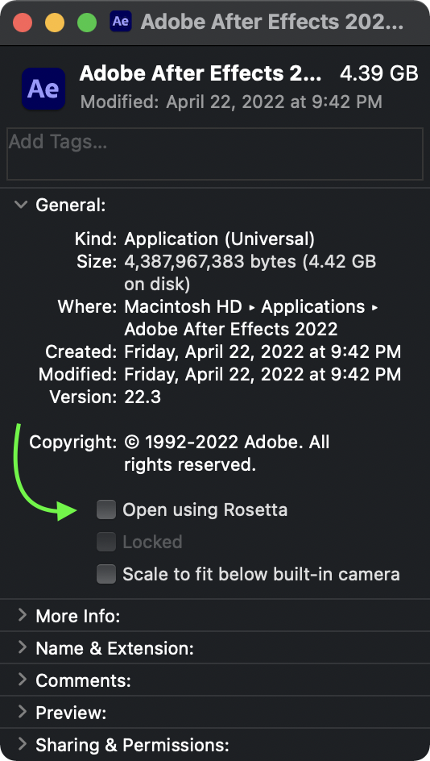

# **Rosetta Guide (MacOS)**
Plugins not showing up in After Effects / How to enable Rosetta / Best version to install

::: info
Starting in 2022, Adobe After Effects runs natively on Apple Silicon and while this is generally a good update in  terms of preformance (Silicon being a powerhouse and successor over Apple's previous Intel Macs), it also poses the issue of outdated plugins not showing up.  
:::
You may notice some of your installed plugins not appearing under your effects panel, or have received the following error message during launch if on a M1+ chip:
## **"The following plugins are installed, but are not yet compatible with this version of After Effects...”**
Most (not all) major plugin developers have released support for Apple Silicon so for legitimate buyers this wouldn’t be an issue, however, it’s safe to assume anyone reading this is pirating and doesn't have access to the latest version for every plugin they plan on using.

That said, you can easily fix this by enabling “Rosetta” assuming an updated crack doesn't exist for it yet (refer to the list below). Do keep in mind that if you enable Rosetta you’ll lose performance benefits that come with owning an Apple Silicon Mac, however, in this situation you'll have to pick whichever is more important to you.

### **What is Rosetta, *exactly*?**

Rosetta acts as a translator, allowing After Effects to run as if it were on an Intel Mac. This in turn makes any third party plugins only built for Intel now compatible as After Effects is ultimately the host, i.e., if After Effects is running as Intel, so do your plugins.  
Enabling Rosetta is a simple process and you only have to do it once. 

::: danger IMPORTANT
- **Adobe removed the option to enable Rosetta in After Effects 2024 and later, scroll down for more info.**
- You may not need Rosetta depending on which plugins you plan to use, scroll down to learn which have been updated with Apple Silicon support.
:::

#### **How to enable Rosetta:**
1. Open Finder
2. Go to Applications and open “Adobe After Effects (Version)” (this is a folder)
3. Right click the application (.app) file inside and click “Get Info”
4. Under the general tab, checkmark “Open using Rosetta”. 

::: info NOTE
You must follow these steps exactly. You won't be able to enable Rosetta through a desktop shortcut.
:::

> **[Click here](https://youtube.com/shorts/dFFfBaWoH0A?si=vG6cgwU9c7WPpx3C) for a video.**  



If the option to enable Rosetta is missing despite doing everything correctly **(excluding After Effects 2024/2025 and Intel Macs, obviously)**, you may need to install Rosetta 2 using a command line.

1. Open Terminal.
2. Paste the following command:
```
sudo softwareupdate --install-rosetta --agree-to-license
```

> **[Click here](https://youtube.com/shorts/LRh7WvCsmy8?si=-b0uGl5cnEW27Py5) for a video.**

***
### **Which After Effects version should I install?**
Read the column that applies to you.

Main points:

- After Effects 2021 and older are not compatible on Sonoma/Sequoia (MacOS 14.0+) and won't launch.

- Starting in After Effects 2024, Adobe permanently removed the option to enable Rosetta rendering plugins only built for intel-macs unusable on M1+.

User | Options
------ | ------
**M1+ chip on MacOS 14+**  |  If having access to unsupported plugins (refer to list below) is important to you, even if it means preformance drops, After Effects 2023 or 2022 are your best options as they still have the option to enable Rosetta, which again is required for Intel-only plugins to work as 2022+ runs natively on Apple Silicon. AE 2021 and below do not work on Sonoma, you will not be able to use these versions. 
**M1+ chip not on MacOS 14+** | If having acesss to unsupported plugins (refer to list below) is important to you, you're safe to install any version excluding 2024+ due to Rosetta being removed, however do keep in mind that enabling Rosetta will drop performance. If you don't have that powerful of a Mac (ex, M1 with 8gb), you may want to consider sticking with 2021 or below. You'd be opting out of newer features in exchange for stability. If you own a higher end mac, performance drops may not be as bad. You'll have to try it for yourself and see.
**Intel Mac on MacOS 14+**  | Because you're on Sonoma, you won't be able to use After Effects 2021 or older, however, because you have an Intel Mac, you don't have to worry about about M1+ chip compatibility, Rosetta, or any of that mess. You're free to install After Effects 2022, 2023, 2024 and 2025, and enjoy all plugins natively. The choice is yours and you can always play around with multiple versions before settling with one.
**Intel Mac not on MacOS 14+** | You have the freedom to install any version of After Effects you'd like. Literally none of this matters to you, however if you ever do upgrade to Sonoma you'll no longer be able to use AE 2021 or below. If you have a higher end Intel-Mac, I would suggest going for a later version such as 2024. If you don't have that powerful of a Mac you may want to consider older versions such as 2020 as they'll likely perform better, but you can always install multiple and experience it yourself.

::: tip INFO
 As mentioned above, enabling Rosetta will drop performance and this will be most noticeable the first time you open After Effects after enabling it. While performance should improve in future launches, it'll never be how it is without and whether or not its "manageable" will vary on your Mac and editing style.
:::

*** 
### **Plugin M1+ Compatibility (List)**
The following list is according to the cracks we provide specifically in **OUR** Discord Server, not what exist legitimately.  Depending on which plugins you plan to use, you may not have to worry about any of this at all. While it is true that some plugins haven't been updated since Apple Silicon, **most** of them are supported.

Only popular plugins are listed. If you’re curious about a plugin that isn't mentioned, you can always look up the developer's release notes, see which version they added M1+ support for, and compare it with ours as versions are usually written in the files name somewhere.


#### **Updated - (does not require Rosetta)**
BCC  
Crossphere Bokeh  
Deep Glow  
Dehancer  
Element 3D  
FilmConvert Nitrate  
Glitchify  
Magic Bullet Looks  
Modulation  
Omino  
Optical Flares  
Pixel Sorter  
RSMB  
Saber  
Sapphire  
Signal  
Trapcode
Twixtor  
Universe  
VFX Suite  

*Scripts and extensions are unaffected.*

#### *Not updated - (**requires** Rosetta)*
All Mettle plugins  
PixDither  
Shooter Suite (Discontinued by developers)  
SpeedX  
TV Distortion Bundle  
Twitch (Developers have yet to release an update)
***
If you don't plan to use any of the "unsupported" plugins or find them to be worth the preformance drops, then feel free to enjoy After Effects 2024/2025 and all the new features it comes with without any worry! :]

::: tip NOTE
 We update what we can, when we can. Currently, our "updated" section is larger than the few other servers that cover MacOS, which is the result of us frequently updating.  
 
 Many servers still provide extremely outdated Mac resources and will spread fear or misinformation to Mac users seeking help because of that. They simply don't know where to look. ^_^
 :::
